# Multithreaded Programming in C — Pthreads vs. OpenMP

> **Parallel & GPU Computing Lab — Experiment 2**  
> *Comparative Study of Low-Level POSIX Threads and Directive-Based OpenMP Concurrency*

[](https://en.wikipedia.org/wiki/C_(programming_language))
[](https://gcc.gnu.org/)
[](https://en.wikipedia.org/wiki/Pthreads)
[](https://www.openmp.org/)
[](https://matplotlib.org/)

---

## Executive Summary

This repository presents a systematic study and comparative benchmark of multithreaded concurrent programming in C using **POSIX Threads (Pthreads)** and **OpenMP**. The experiments systematically explore thread lifecycles, work partitioning, shared-memory concurrency, data race conditions, synchronization primitives (mutexes vs. critical sections), barrier coordination, and compiler reductions.

To quantitatively evaluate performance scalability, identical compute-heavy workloads ($N = 1,000,000,000$ iterations computing $\sum_{i=0}^{N-1} i \times 10^{-6}$) were measured across varying thread counts (**1, 2, 4, 6, and 16 worker threads**).

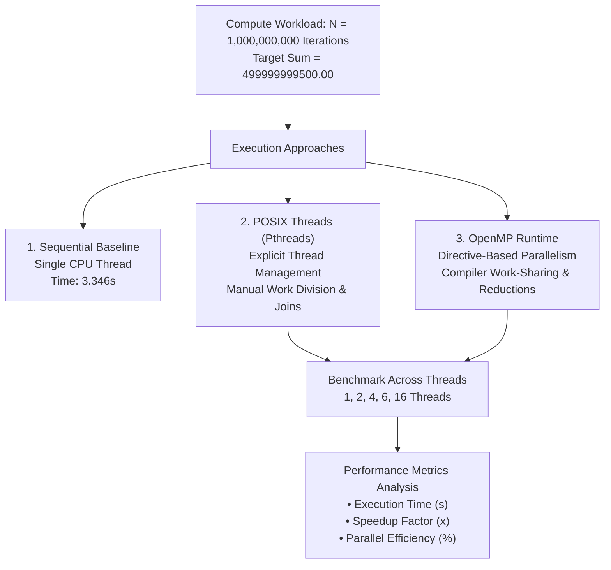

### Key Performance Findings
* **Sequential Baseline:** Single-threaded execution took **`3.346414 s`**.
* **Pthreads at 16 Threads:** Reduced runtime to **`0.530415 s`** (**`6.309x`** speedup, **`39.43%`** efficiency).
* **OpenMP at 16 Threads:** Reduced runtime to **`0.448971 s`** (**`7.454x`** speedup, **`46.58%`** efficiency).
* **Takeaway:** OpenMP outperformed manual Pthreads partitioning at high thread counts due to low-overhead runtime thread pooling and compiler-vectorized tree reductions, while both implementations clearly demonstrated Amdahl's Law and memory bus saturation as thread counts scaled to 16.

---

## Conceptual Overview: Pthreads vs. OpenMP

| Feature | POSIX Threads (Pthreads) | OpenMP |
|---|---|---|
| **Programming Paradigm** | Explicit library API (Low-level) | Compiler directives & runtime (High-level) |
| **Thread Creation** | Explicit call to `pthread_create()` | Implicit via `#pragma omp parallel` |
| **Work Partitioning** | Manual index boundary calculation by developer | Automatic scheduling via `#pragma omp parallel for` |
| **Synchronization** | Explicit mutex lock/unlock (`pthread_mutex_t`) | Structured blocks (`#pragma omp critical`) |
| **Coordination** | Explicit `pthread_join()` / condition variables | Implicit barrier at region end or `#pragma omp barrier` |
| **Reduction** | Manual partial sum buffers and serial aggregation | Built-in clause `reduction(+:variable)` |
| **Control Level** | Fine-grained, hardware-near thread control | Rapid development, directive-driven optimization |

### Race Conditions & Synchronization Mechanics
When multiple threads update a shared variable (`counter++`) concurrently without protection, a **race condition** occurs because `counter++` is not atomic at the CPU machine-instruction level:
1. **Read:** Register loads current memory value.
2. **Modify:** ALU increments the register value.
3. **Write:** Register stores updated value back to RAM.

Without synchronization, simultaneous reads cause interleaved writes to overwrite each other, causing lost updates.

```
Thread A:  [Read: 100] -----> [Increment: 101] -----> [Write: 101]
Thread B:       [Read: 100] -----> [Increment: 101] -------------> [Write: 101] (Update Lost!)
```

* **Pthreads Fix:** Mutual exclusion lock (`pthread_mutex_lock` / `pthread_mutex_unlock`) ensures only one thread executes the critical section at any moment.
* **OpenMP Fix:** Directive `#pragma omp critical` serializes execution of the enclosed block across all active threads.
* **Reduction Optimization:** Instead of serializing every addition with locks (which causes massive lock contention), each thread maintains a thread-private accumulator and combines results into a global accumulator at the end using `#pragma omp parallel for reduction(+:sum)`.

---

## Quantitative Benchmark Results

The benchmark calculates $\sum_{i=0}^{N-1} i \times 10^{-6}$ for $N = 10^9$ iterations. The verified correct output across all runs is:
$$\text{Result} = 499999999500.00$$

### Performance Metrics Table

| Worker Threads | Pthreads Time (s) | OpenMP Time (s) | Pthreads Speedup | OpenMP Speedup | Pthreads Efficiency | OpenMP Efficiency |
|:---:|:---:|:---:|:---:|:---:|:---:|:---:|
| **Baseline (1)** | 3.346414 | 3.346414 | 1.000x | 1.000x | 100.00% | 100.00% |
| **1 Thread** | 3.205682 | 3.186103 | 1.044x | 1.050x | 104.39% | 105.03% |
| **2 Threads** | 1.689293 | 1.662809 | 1.981x | 2.013x | 99.05% | 100.63% |
| **4 Threads** | 0.947512 | 0.978149 | 3.532x | 3.421x | 88.29% | 85.53% |
| **6 Threads** | 0.850071 | 0.841213 | 3.937x | 3.978x | 65.61% | 66.30% |
| **16 Threads** | **0.530415** | **0.448971** | **6.309x** | **7.454x** | **39.43%** | **46.58%** |

*Formulas:*
* $\text{Speedup } (S) = \frac{T_{\text{sequential}}}{T_{\text{parallel}}}$
* $\text{Efficiency } (E) = \frac{S}{p} \times 100\%$ *(where $p$ is the number of threads)*

---

## High-Resolution Performance Visualizations

### 1. Executive Performance Dashboard
Comprehensive 3-panel evaluation comparing execution duration, speedup factors, and parallel efficiency side-by-side:

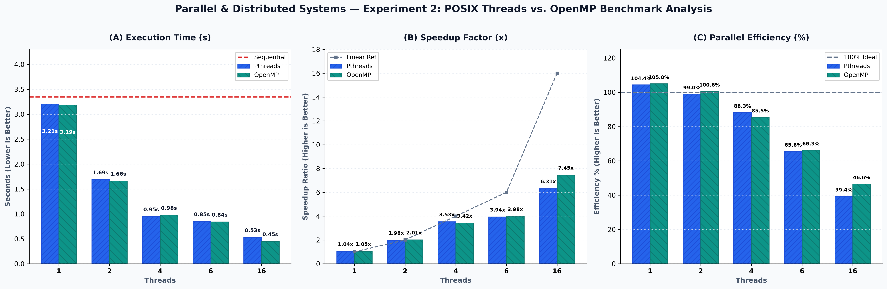

---

### 2. Execution Time Comparison (Lower is Better)
Execution duration drops rapidly as thread count increases from 1 to 4 threads, with OpenMP achieving the fastest turnaround of **`0.45s`** at 16 threads:

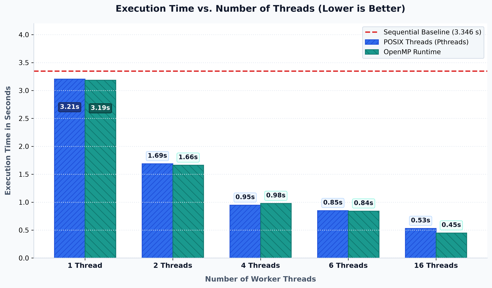

---

### 3. Parallel Speedup Analysis (Higher is Better)
Speedup tracks near-linear scaling up to 4 threads, after which overhead dampens further gains:

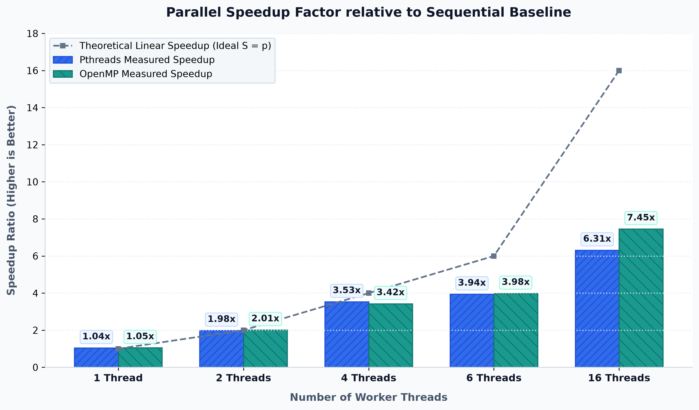

---

### 4. Parallel Efficiency Analysis
Demonstrates hardware scaling limits: efficiency remains near ~90–100% up to 4 cores, tapering to ~40–47% at 16 threads due to synchronization, cache contention, and memory bandwidth bounds:

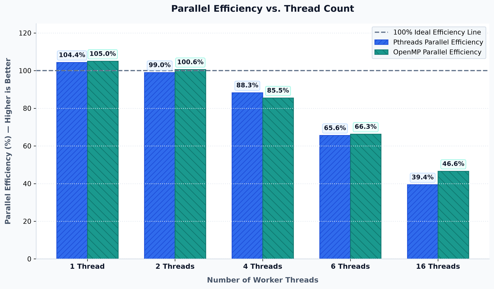

---

## Experimental Proof & Output Gallery

### Part A — POSIX Threads (Pthreads)

| Program | Objective | Verification Output Screenshot |
|---|---|---|
| `pthreads/thread1.c` | Basic thread creation and termination using `pthread_create()` and `pthread_join()` | 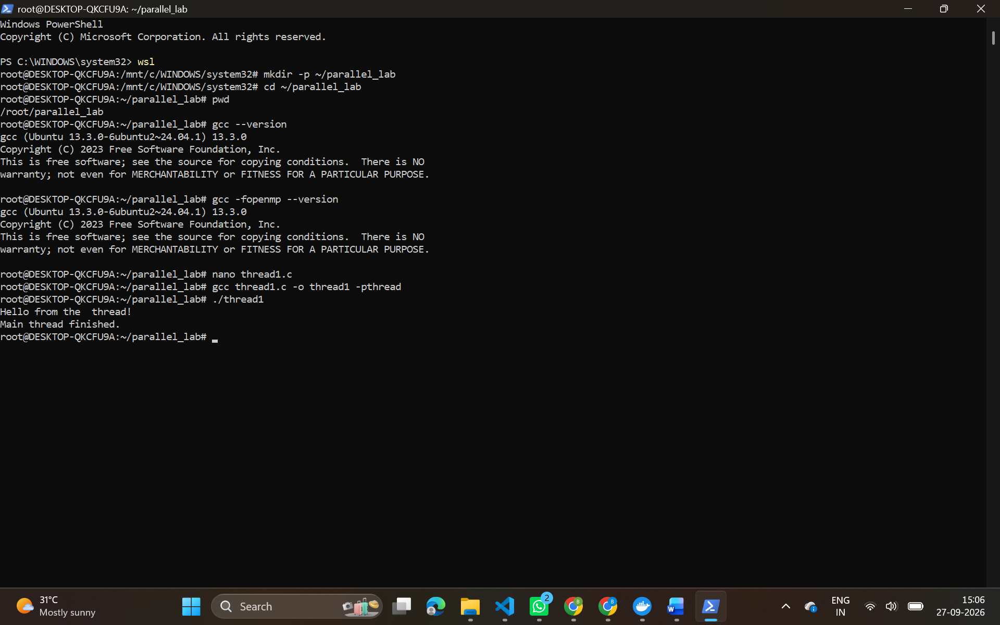 |
| `pthreads/multiple_threads.c` | Spawning and coordinating multiple independent worker threads | 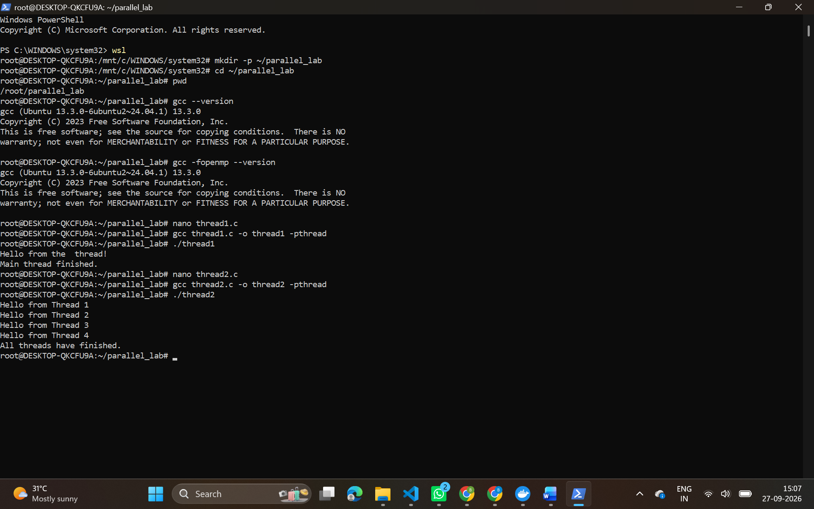 |
| `pthreads/thread_sum.c` | Manual block-based workload distribution and partial summation | 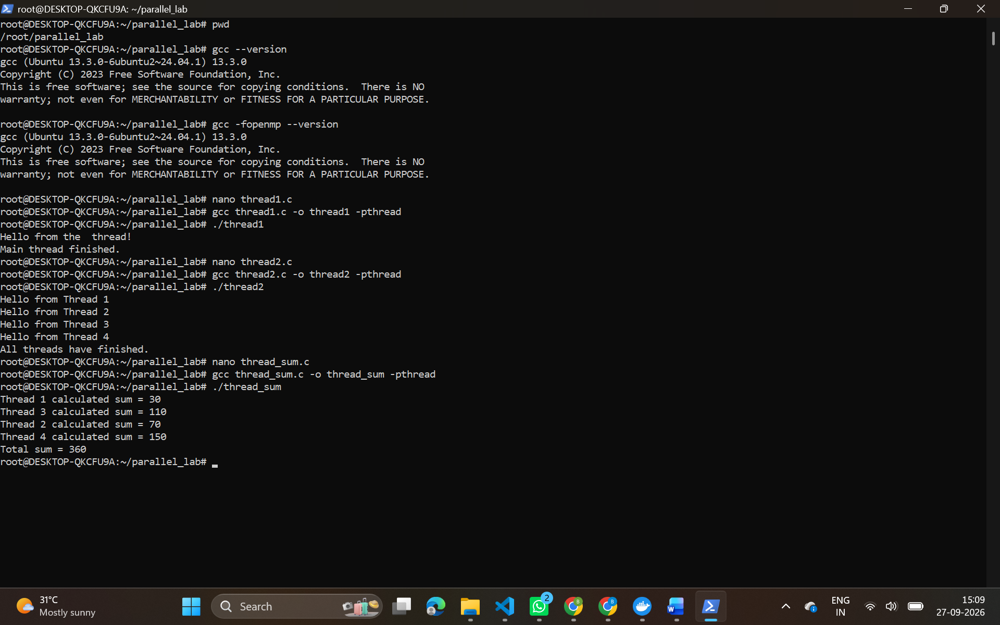 |
| `pthreads/race.c` | Deliberate race condition demonstration with concurrent shared counter increments | 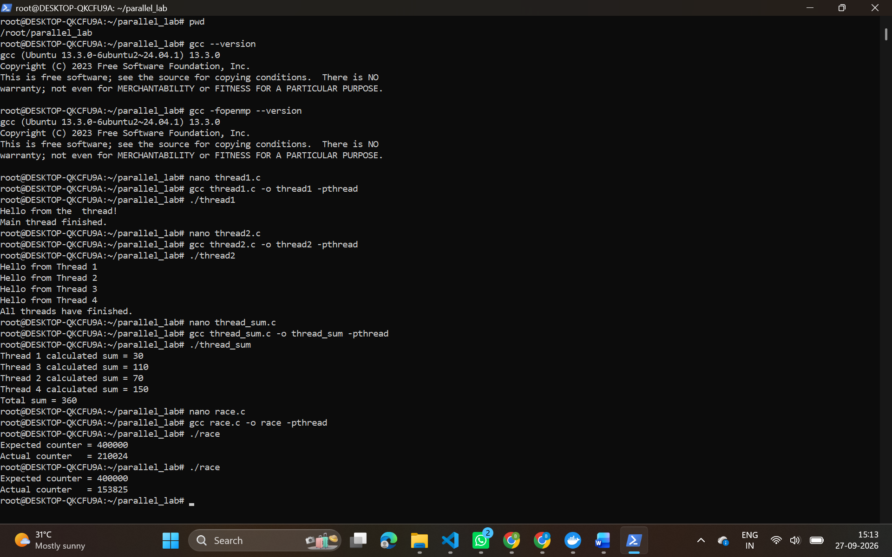 |
| `pthreads/mutex.c` | Eliminating data race using POSIX mutual exclusion (`pthread_mutex_t`) | 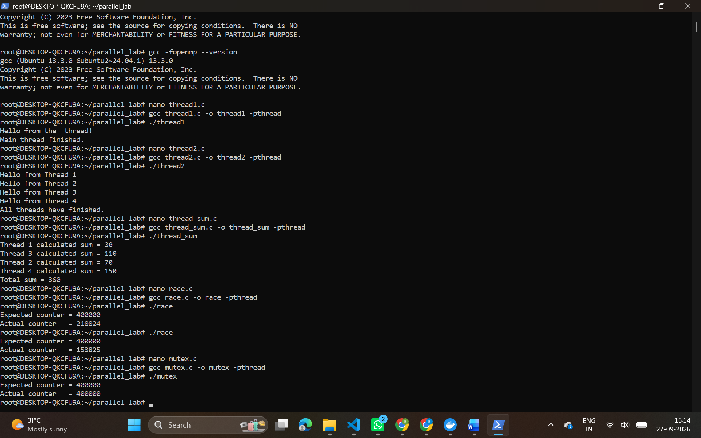 |
| `pthreads/pthread_perf.c` | Scaling benchmark measuring timing across 1, 2, 4, 6, and 16 worker threads | 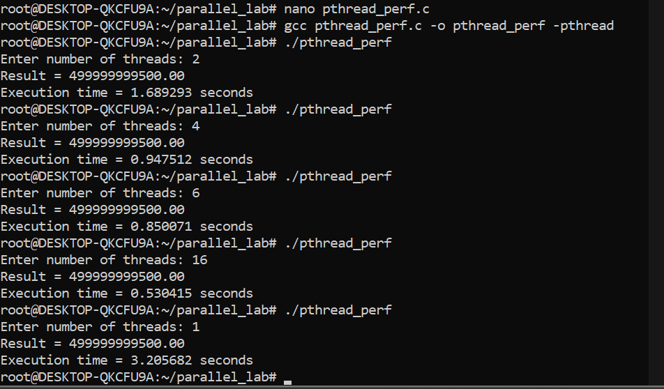 |

---

### Part B — OpenMP (Open Multi-Processing)

| Program | Objective | Verification Output Screenshot |
|---|---|---|
| `openmp/omp1.c` | Basic parallel region instantiation and thread ID reporting (`omp_get_thread_num`) | 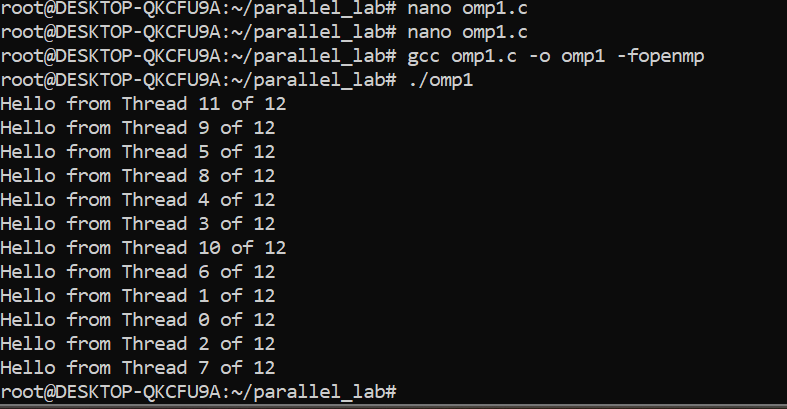 |
| `openmp/omp_sum.c` | Work-sharing loop parallelization using directive reduction (`reduction(+:sum)`) | 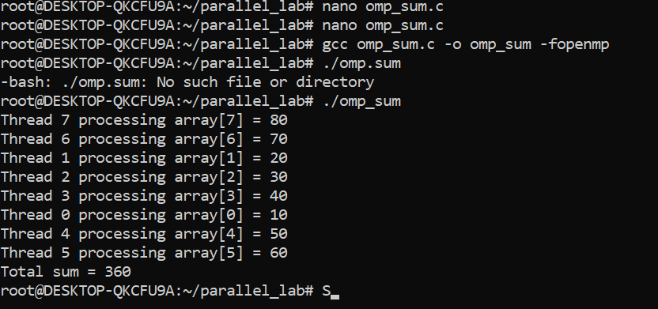 |
| `openmp/omp_critical.c` | Eliminating concurrent modification race condition using `#pragma omp critical` | 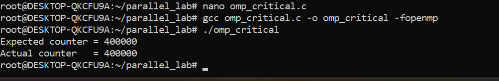 |
| `openmp/omp_barrier.c` | Explicit thread synchronization and rendezvous points using `#pragma omp barrier` | 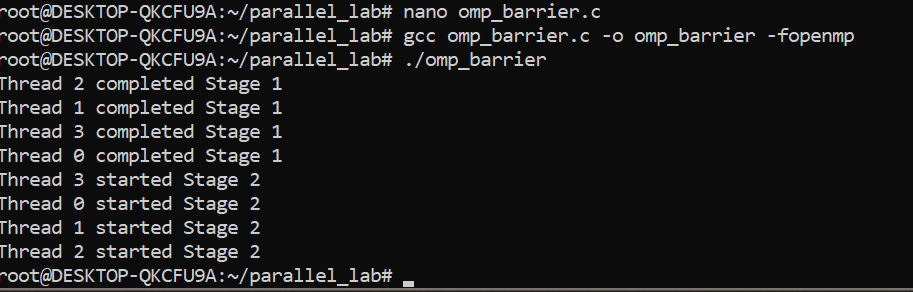 |
| `openmp/omp_perf.c` | Scaling benchmark measuring timing across 1, 2, 4, 6, and 16 OpenMP threads | 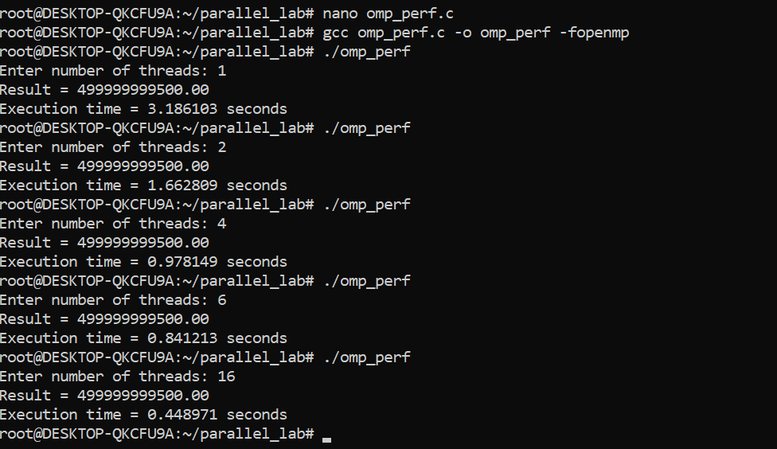 |

---

### Part C — Sequential Baseline

| Program | Objective | Verification Output Screenshot |
|---|---|---|
| `performance_analysis/sequential.c` | Single-core baseline execution timing for identical $10^9$ iteration workload (**3.346s**) | 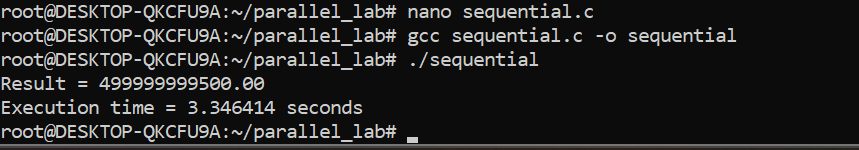 |

---

## Repository Structure

```
PGC_LAB02/
├── images/                                 # High-resolution benchmark charts & terminal screenshots
│   ├── efficiency_chart.png
│   ├── execution_time_chart.png
│   ├── performance_comparison_charts.png
│   ├── speedup_chart.png
│   ├── multiple_threads_result.png
│   ├── mutex_result.png
│   ├── omp1_result.png
│   ├── omp_barrier_result.png
│   ├── omp_critical_result.png
│   ├── omp_perf_result.png
│   ├── omp_sum_result.png
│   ├── pthread_perf_result.png
│   ├── racecondition_result.png
│   ├── sequential_result.png
│   ├── thread1_result.png
│   └── thread_sum_result.png
│
├── openmp/                                 # OpenMP directive-based implementations
│   ├── omp1.c
│   ├── omp_barrier.c
│   ├── omp_critical.c
│   ├── omp_race.c
│   └── omp_sum.c
│
├── performance_analysis/                   # Performance benchmarking programs
│   ├── omp_perf.c
│   ├── pthread_perf.c
│   └── sequential.c
│
├── pthreads/                               # POSIX threads implementations
│   ├── multiple_threads.c
│   ├── mutex.c
│   ├── race.c
│   ├── thread1.c
│   └── thread_sum.c
│
├── scripts/                                # Utility and visualization scripts
│   └── generate_charts.py                  # Generates publication-ready performance charts
│
├── .gitignore                              # Git ignore rules for binaries and system files
└── README.md                               # Project documentation & benchmark report
```

---

## How to Reproduce the Entire Experiment (Step-by-Step Guide)

Follow this exact guide to replicate all benchmark results, verify synchronization behaviors, and regenerate the analytical charts on your own machine.

### Prerequisites & Environment Setup

The benchmarks are designed for Linux (Ubuntu 20.04/22.04 LTS or **Windows Subsystem for Linux — WSL2**).

1. **Launch Terminal / WSL:**
   On Windows, open PowerShell and type:
   ```bash
   wsl
   ```

2. **Install Required Build Tools & Python Libraries:**
   ```bash
   sudo apt update
   sudo apt install -y build-essential gcc git python3 python3-pip python3-matplotlib python3-numpy
   ```

3. **Verify GCC & OpenMP Support:**
   ```bash
   gcc --version
   gcc -fopenmp --version
   ```

4. **Clone Repository & Enter Workspace:**
   ```bash
   git clone https://github.com/DivyaKumari29/PGC_LAB02.git
   cd PGC_LAB02
   ```

---

### Step 1: Run the Sequential Baseline

Measures the single-threaded execution time for $N = 1,000,000,000$ iterations. This number serves as the baseline for all speedup and efficiency calculations.

```bash
cd performance_analysis
gcc -O2 sequential.c -o sequential
./sequential
cd ..
```

* **Expected Output:**
  ```text
  Result = 499999999500.00
  Time taken = ~3.346414 seconds
  ```

---

### Step 2: Reproduce Pthreads Scaling Benchmarks

Compile and execute the Pthreads scaling program across varying thread configurations:

```bash
cd performance_analysis
gcc -pthread -O2 pthread_perf.c -o pthread_perf
```

Run the program once for each thread count (enter the number when prompted):

```bash
./pthread_perf
# Input: 1  -> Expected time: ~3.205s (Speedup: ~1.04x)

./pthread_perf
# Input: 2  -> Expected time: ~1.689s (Speedup: ~1.98x)

./pthread_perf
# Input: 4  -> Expected time: ~0.947s (Speedup: ~3.53x)

./pthread_perf
# Input: 6  -> Expected time: ~0.850s (Speedup: ~3.93x)

./pthread_perf
# Input: 16 -> Expected time: ~0.530s (Speedup: ~6.30x)

cd ..
```

---

### Step 3: Reproduce OpenMP Scaling Benchmarks

Compile and run the OpenMP performance test across the same thread counts:

```bash
cd performance_analysis
gcc -fopenmp -O2 omp_perf.c -o omp_perf
```

Run the executable for each thread count:

```bash
./omp_perf
# Input: 1  -> Expected time: ~3.186s (Speedup: ~1.05x)

./omp_perf
# Input: 2  -> Expected time: ~1.662s (Speedup: ~2.01x)

./omp_perf
# Input: 4  -> Expected time: ~0.978s (Speedup: ~3.42x)

./omp_perf
# Input: 6  -> Expected time: ~0.841s (Speedup: ~3.97x)

./omp_perf
# Input: 16 -> Expected time: ~0.448s (Speedup: ~7.45x)

cd ..
```

---

### Step 4: Reproduce Race Condition & Synchronization Experiments

#### A. Pthreads Race Condition vs. Mutex
1. **Observe Lost Updates (Race Condition):**
   ```bash
   cd pthreads
   gcc -pthread race.c -o race
   ./race
   ```
   *Expected:* Output counter is unpredictably less than `400000` (e.g. `278453` or `312890`) due to unsynchronized memory writes.

2. **Verify Correctness via POSIX Mutex:**
   ```bash
   gcc -pthread mutex.c -o mutex
   ./mutex
   ```
   *Expected:* Output counter is consistently and correctly `400000`.

3. **Verify Work Sharing & Reduction:**
   ```bash
   gcc -pthread thread_sum.c -o thread_sum
   ./thread_sum
   cd ..
   ```

#### B. OpenMP Critical Sections & Barriers
1. **Observe Race Condition in OpenMP:**
   ```bash
   cd openmp
   gcc -fopenmp omp_race.c -o omp_race
   ./omp_race
   ```

2. **Verify Fix with Critical Section:**
   ```bash
   gcc -fopenmp omp_critical.c -o omp_critical
   ./omp_critical
   ```

3. **Verify Barrier Coordination:**
   ```bash
   gcc -fopenmp omp_barrier.c -o omp_barrier
   ./omp_barrier
   ```
   *Expected:* All threads pause at `#pragma omp barrier` and resume synchronously.

4. **Verify Work Sharing with Reduction:**
   ```bash
   gcc -fopenmp omp_sum.c -o omp_sum
   ./omp_sum
   cd ..
   ```

---

### Step 5: Regenerate Performance Visualization Charts

To redraw all publication-ready graphs with the custom design system:

```bash
# Ensure matplotlib & numpy are installed
python3 -m pip install matplotlib numpy

# Execute the visualization pipeline
python3 scripts/generate_charts.py
```

* **Output:**
  The script automatically regenerates and saves all high-resolution figures directly to `images/`:
  * `images/performance_comparison_charts.png` (3-panel dashboard)
  * `images/execution_time_chart.png`
  * `images/speedup_chart.png`
  * `images/efficiency_chart.png`

---

## Key Conclusions

1. **Scalability:** Both Pthreads and OpenMP provide dramatic performance improvements over single-threaded sequential code, slashing execution time from **3.35s down to ~0.45s–0.53s** (a **>6x–7.4x** speedup).
2. **OpenMP Efficiency at Scale:** OpenMP achieved a slightly higher speedup at 16 threads (**7.45x** vs. **6.31x**) due to its highly optimized work-sharing thread pool and compiler-level reduction mechanisms.
3. **Diminishing Returns (Amdahl's Law):** Moving from 1 to 4 threads yields near-linear speedup (~88% efficiency), but scaling from 6 to 16 threads sees efficiency decline to ~40–47% as synchronization, thread orchestration, and hardware memory bus saturation begin to dominate runtime.
4. **Synchronization Tradeoffs:** Unprotected shared state operations result in catastrophic race conditions; while mutex locks enforce strict correctness, algorithmic work distribution with private accumulators and reductions is vastly superior for performance-critical computing.
